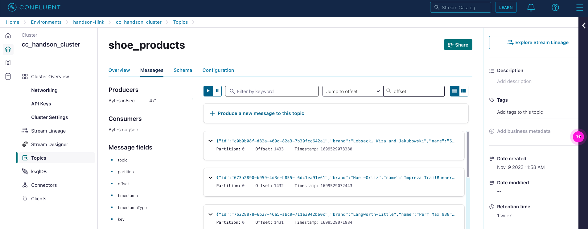
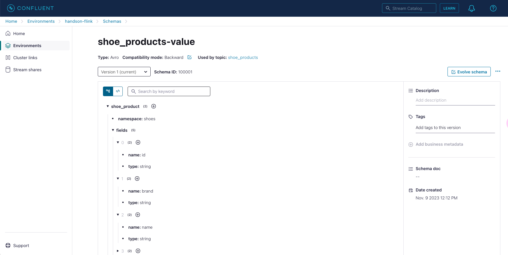
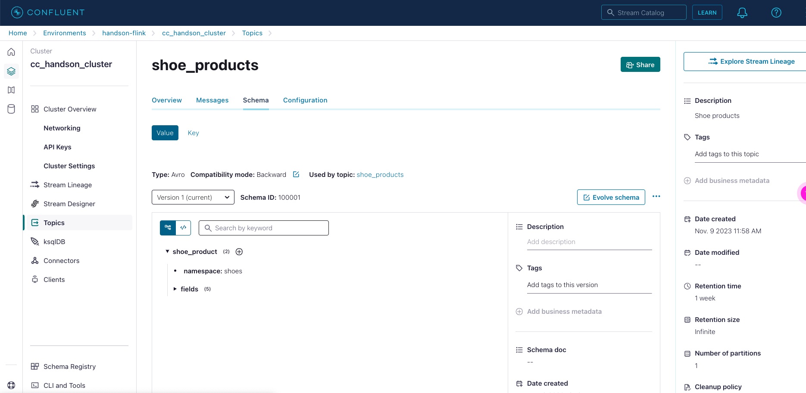

# Prerequisites
Before we can run the hands-on workshop, a working infrastructure in Confluent Cloud must exist:
- only AWS cloud provider (Flink SQL Preview is running in AWS only. 16-Nov-2023)
- an environment with Schema Registry enabled,
- a Kafka Cluster,
- 3 topics
- events generated by our Sample Data Datagen Source connector

And of course, to do all of this we need a working account for Confluent Cloud.
Sign-up with Confluent Cloud is very easy and you will get a $400 budget for our Hands-on Workshop.
If you don't have a working Confluent Cloud account please [Sign-up to Confluent Cloud](https://www.confluent.io/confluent-cloud/tryfree/?utm_campaign=tm.campaigns_cd.Q124_EMEA_Stream-Processing-Essentials&utm_source=marketo&utm_medium=workshop).

Now you have two possibilities to create the Hands-On Workshop Confluent Cloud resources:
1. Let terraform create it: If you are comfortable running terraform, then follow this [guide](terraform/README.md).
2. Create all resources manually.

On your desktop we expect that confluent cli installed. [install the cli](https://docs.confluent.io/confluent-cli/current/install.html) on your desktop. You need the cli to run the flink SQL shell. 
The shell gives you better experience in the workshop. 
Please bring the cli on the latest version (Version: v3.41.0):
```
confluent update
```

## Confluent Cloud Resources for the Hands-on Workshop: Manual Setup

IMPORTANT TO KNOW FOR THE WORKSHOP:
We run in AWS only. Currently we do support [4 Regions](https://docs.confluent.io/cloud/current/flink/reference/op-supported-features-and-limitations.html#cloud-regions) within AWS cloud.
The complete onsite team is working in region: `eu-central-1` (all terraform and manual guide do not need to change)
The online team is working in different regions:
 - Attendees with Lastname first Letter A-I working in region `us-east-1`
      + Environment Schema Registry in `us-east-2`
      + Confluent Cloud Cluster in `us-east-1`
 - Attendees with Lastname first Letter J-R working in region `us-east-2` 
      + Environment Schema Registry in `us-east-2`
      + Confluent Cloud Cluster in `us-east2`
 - Attendees with Lastname first Letter S-Z working in region `eu-west-1` 
      + Environment Schema Registry in `eu-central-1`
      + Confluent Cloud Cluster in `eu-west-1`

You can create each Confluent Cloud resource with the confluent cli tool and/or Confluent Cloud Control Plane GUI.
Both are using the confluent cloud API in background.
If you would like to use the cli, you need to [install the cli](https://docs.confluent.io/confluent-cli/current/install.html) on your desktop. This workshop guide will cover the GUI only.

### Create Environment and Schema Registry
Login into Confluent Cloud and create an environment with Schema Registry:
* Click `Add cloud environment`  button
* Enter a New environment name e.g. `handson-flink` and push `create` button
* Choose Essentials Stream Governance package and click `Begin configuration`
        * Choose AWS with region eu-central-1 (Compare rule with your lastname, see above), currently flink SQL (Preview) is only available in AWS, but will be soon available for all Azure and Google regions.
        * Click button `Enable`

Environment is ready to work and includes a Schema Registry in AWS in choosed region.


### Create Kafka Cluster in Environment `handson-flink`

The next step is to create a Basic Cluster in AWS region based on the rule above (Compare rule with your lastname, see above).
Click button `Create cluster` 
* choose BASIC `Begin configuration` button to start the cluster creation config.
* Choose AWS and the region with Single zone and click `Continue`
* Give the cluster a name , e.g. `cc_handson_cluster` and check rate card overview and configs, then press `Launch cluster` 

The cluster will be up and running in seconds.


### Create topics in Kafka Cluster `cc_handson_cluster`
Now, we need three topics to store our events.
* shoe_products
* shoe_customers
* shoe_orders

Via the GUI the topic creation is very simple.
Create Topic by clicking (left.hand menu) Topics and then click `Create topic` button.
* Topic name : shoe_products, Partitions : 1 and then click `Create with defaults` button
* Repeat the same steps for shoe_customers and shoe_orders 

Three topics are created.


### Create Sample Data connectors to fill the topics `show_products` and `shoe_customers` and `shoe_orders`
Confluent has the Datagen connector, which is a testdata generator. In Confluent Cloud a couple Quickstarts (predefinied data) are available and will generate data of a given format.
NOTE: We use Datagen with following templates:
* Shoe Products https://github.com/confluentinc/kafka-connect-datagen/blob/master/src/main/resources/shoes.avro
* Shoe Customers https://github.com/confluentinc/kafka-connect-datagen/blob/master/src/main/resources/shoe_customers.avro
* Shoe Orders https://github.com/confluentinc/kafka-connect-datagen/blob/master/src/main/resources/shoe_orders.avro

Choose the `Connectors` menu entry (left site) and search for `Sample Data`. Click on the Sample Data Icon.
* Choose topic: `shoe_products` and click `Continue`
* Click Global Access (which is already selected by default) and download the API Key. Typically, you will give the connector restrictive access to your resources (what we did in the terraform setup). But for now, it seems to be good enough for hands-on. Click `Generate API Key & Download`, enter a description `Datagen Connector Products` abd click `continue`
* Select format `AVRO`, because Flink requires AVRO for now, and a template (Show more Option) `Shoes` and  click `Continue`
* Check Summary, we will go with one Task (slider) and click `Continue`
* Enter a name `DSoC_products` and finally click `Continue` 

Now, events will fly in topic `shoe_products` generated from datagen connector `DSoC_products`


If you click on `Stream Lineage` (left side) and will see your current data pipeline. Click on topic `shoe_products` and enter the description `Shoe products`. This is how you place metadata to your data product.


Go back to your Cluster `cc_handson_cluster` and create two more datagen connectors to fill the topics shoe_customers and shoe_orders, go to `Connectors` and click `Add Connector`. Pay attention when you select the template for the datagen connector and ensure, that it corresponds with the before selected topic as shown in the following. Deviations in this step will result in invalid queries at later stages in the workshop.
* Connector Plug-in `Sample Data`, Topic `shoe_customers`, Global Access amd Download API Key with Description `Datagen Connector Customers`, Format `AVRO`, template `Shoe customers`, 1 Task, Connector Name `DSoC_customers` 
* Connector Plug-in `Sample Data`, Topic `shoe_orders`, Global Access amd Download API Key with Description `Datagen Connector Orders`, Format `AVRO`, template `Shoe orders`, 1 Task, Connector Name `DSoC_orders` 

Three Connectors are up and running and are generating data for us.


What is really pretty cool, is that all three connectors are generating events in AVRO format and created automatically a schema for all three topics.
You can have a look for the schema in the Schema Registry.


Or just use the topic viewer, where you can
- view the events flying in
- all meta data information
- configs
- and schemas as well



The preapration is finished. Well done.

The infrastructure for the Hands-on Workshop is up and running. And we can now start to develop our use case of a loyalty program in Flink SQL.


End of prerequisites, continue with [LAB 1](lab1.md).
