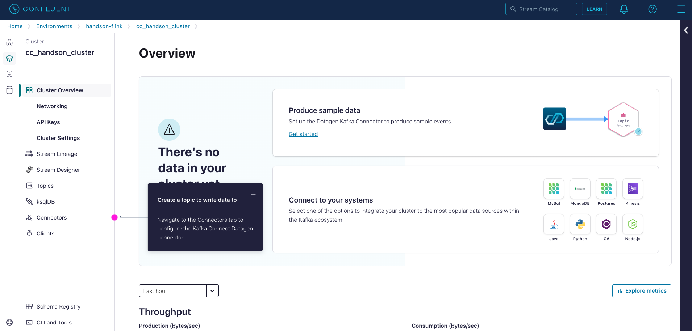
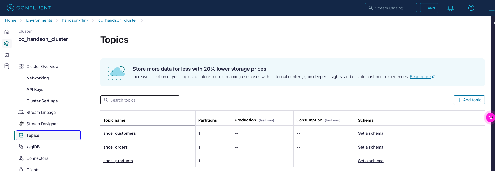
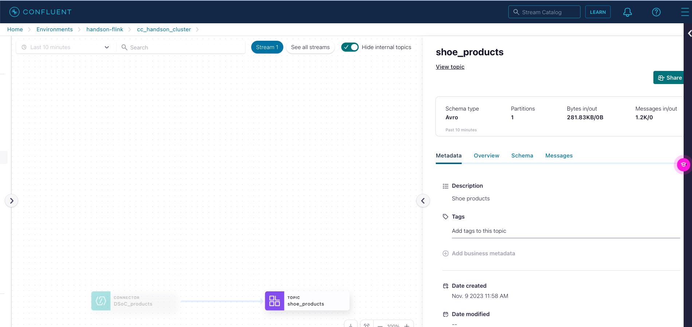
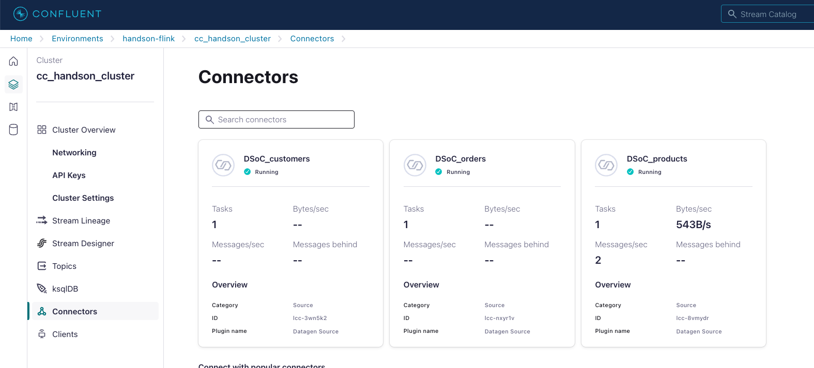

# Prerequisites
Before we can run the hands-on workshop, we need to create a working infrastructure in Confluent Cloud:
- We need an environment with Schema Registry enabled,
- We need a Kafka Cluster,
- We need topics
- We need events generated by our datagen testdata generator connector
- and finally we need a Flink SQL compute pool.

And of course to do all of this we need a working account for Confluent Cloud.
Sign-up with Confluent Cloud is very easy and you will get $400 for our Hands-on Workshop.
If you don't have a working Confluent Clooud account please [Sign-up to Confluent Cloud](https://www.confluent.io/confluent-cloud/tryfree/?utm_campaign=tm.campaigns_cd.Q124_EMEA_Stream-Processing-Essentials&utm_source=marketo&utm_medium=workshop).

Now you have two possibilties to create the Hands-On Workshop Confluent Cloud resources:
1. Let terraform create it: If you are comfortable with running terraform, then follow this[guide](terraform/README.md)
2. Create all resources manually.

## Confluent Cloud Resources for the Hands-on Workshop: Manual Setup
You can create each Confluent Cloud resource with the confluent cli tool and Confluent Cloud Control Plane GUI.
Both are using API in background.
If you would like to use the cli, you need to [install the cli](https://docs.confluent.io/confluent-cli/current/install.html) on your desktop. Here in this workshop we try to work in the browser, that's we doing a setup with the GUI.

### Create Environment and Schema Registry
Login into Confluent Cloud and create am environment with Schema Registry:
* Click `Add cloud environment`  button
* enter a New environment name e.g. handson-flink and push `create` button
* Choose Essentials Stream Governance package and click `begin configuration`
        * Choose AWS and Region eu-central-1 (Frankfurt), currently flink SQL is only available in AWS, but will be soon available for all azure and google as well
        * Click button `Enable`

Environment is ready to work and includes a schema registray in AWS in region Frankfurt.

### Create Kafka Cluster in Environment `handson-flink`

The next step is to create a Basic Cluster in AWS region eu-central-1.
Click button `create cluster` 
* choose BASIC `begin configuration` button to start the cluster creation config.
* Choose AWS and the region eu-central-1 with Single zone and click `Continue`
* Give the cluster a name , e.g. `cc_handson_cluster` and check rate card overview and configs, then press `Launch cluster` 

The cluster will be up and running in seconds.

### Create topics in Kafka Cluster `cc_handson_cluster`
Now, we need three topics, to store our events.
* shoe_products
* shoe_customers
* shoe_orders
Via the GUI the topic creation is very simple.
Create Topic by clicking (left.hand menu) Topics and then click `Create Topic` button
* Topic name : shoe_products, Partitions : 1 and then push `Create with defaults` button
     * Do the same for shoe_customers and shoe_orders 

Three topics are created.

### Create Datagenerator connectors to fill the topics `show_products and shoe_customers and shoe_orders`
Confluent has the datagen connector, which a testdata generator. In Confluent Clooud a couple Quickstarts are available and will generate of a given format.
NOTE: We use Datagen with following templates:
* Shoe Products https://github.com/confluentinc/kafka-connect-datagen/blob/master/src/main/resources/shoes.avro
* Shoe Customers https://github.com/confluentinc/kafka-connect-datagen/blob/master/src/main/resources/shoe_customers.avro
* Shoe Orders https://github.com/confluentinc/kafka-connect-datagen/blob/master/src/main/resources/shoe_orders.avro

Choose the `Connectors` menu entry (left site) and search for `Sample Data`. Click on the Sample Data Icon.
* Choose topic: `show_products` and click `continue`
* Click Global Access (which is already selected by default) and download the API Key. Typically you will give the connector restrictive access to your resources (what we did in the terraform setup). But for now, it seems to be good enough for hands-on. Click `Generate API Key & Download`, enter a description `Datagen Connector Products` abd click `continue`
* Select format `AVRO`, because Flink requires AVRO for now, and a template (Show more Option) `Shoes` and  click `continue`
* Check Summary, we will go with one Task (slider) and click `continue`
* Enter a name `DSoC_products` and finally click `continue` 

Now, events will fly in topic `shoe_products` generated from datagen connector `DSoC_products`

If you click on `Stream Lineage` (left side) and will see your current data pipeline. Click on topic `shoe_products` and enter the description `Shoe products`.

Go back to your Cluster `cc_handson_cluster` and create two more datagen connector to fill the topics shoe_customers and shoe_orders, got to `Connectors` and click `Add Connector`
* Connector Plug-in `Sample Data`, Topic `shoe_customers`, Global Access amd Download API Key with Description `Datagen Connector Customers`, Format `AVRO`, template `Shoe customers`, 1 Task, Connector Name `DSoC_customers` 
* Connector Plug-in `Sample Data`, Topic `shoe_orders`, Global Access amd Download API Key with Description `Datagen Connector Orders`, Format `AVRO`, template `Shoe orders`, 1 Task, Connector Name `DSoC_orders` 

Three Connectors are up and running and are generating data for us.

What is really pretty cool, is that all three connectors are generating events in AVRO format and created automatically a schema for all three topics.
You can have a look for the schema in the Schema Registry.

Or just use the topic viewer, where can
- view the events flying in
- all meta data information
- configs
- and schemas as well

### Create Flink Compute Pool in environment `handson-flink`
Go back to environment `handson-flink` and choose `Flink (preview)`. From there we create a new compute pool:
* choose AWS region eu-central-1, click `continue` and 
* enter Pool Name: `cc_flink_compute_pool` with 5 Confluent Flink Units (CFU) and 
* click `continue` button and then `finish`.
The pool will be provisioned and ready to work with a couple of moments.

open the SQLWorksheet of compute pool and set:
- the environment name `handson-flink` as catalog
- and the cluster name `cc_handson_cluster` as database
Via the dropdown boxes, see graphic

The infrastructure for the Hands-on Workshop is up and running. And we can now start to develop our use case of a loyalty program in Flink SQL.

End of prereq, start with [LAB 1](lab1.md)